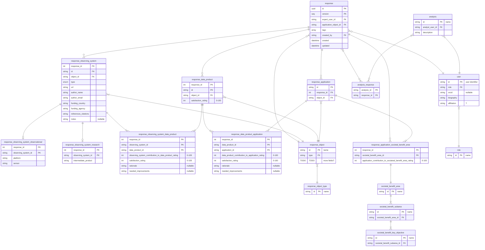

[View in Mermaid Live Editor (features pan and zoom)](https://mermaid.live/edit#pako:eNrNWFtv2zYU_isEgQIt4BhOHNeOX4oBQV-KocPap0GAQEtHMTeJVEkqqxb7v--QkhxRF1tJ9jA_2DB5vo_nziM90UjGQLcU1D1nD4plgQjEu3fkvhQs4xGROShmuBQsJTEzbBuIQoMiT4Eg-NFGcfFAeEx--0IC6rZ4DMLwhIMKqCelZArk8xdvTaoIwQEVRZqyXQodyI5LVCrfl94qSxKecqcWQj9ZzNHqrUDnUmhotCsK5Ha61XD4QR5BaYuzax4p_ERTTWhNCBHT0ZPlecojd2Qod39CZBqhSowpxUpi2IPu0EYKmIE43JUnSvQjGJ5Bs9dZLfK4WnU2PVuF56Juj0ga6lIbyBozuTDkJNQ2txUc3-kDBoAoMmLKHDzJQqW-GwqzlyrE3IChdcgY9wFJIWKrcSQLYVQ5uMceQET-loIEFK6CDiNunNu1JyCkAd3Jm2Odu9_3XBOrIsHfSIqk0AiZkV1hEFF5sc7pgJKQ65AwZzqRCTk5mVROPuP_0KOaGI0eSS3iCeUpM4lUmbeoQWipOqneVwp3gKlo_2Z9_CQSBlQGMVYdhLmScRGZi6rYhtEIv1Gdlkib1fee5e4RYAIgDmNvS9dIT6nQ9jakDOji6nqxaJqP5dG4oxMWOdiwWJOrdQLAeBsTADH2AJ7huY-QYX8czN2TX17huMtVPtm2cV3CVhucqNdQtEb6ai-WHrYbxzbyfxrGAW_50Rr24OdzcRw9IdQy4mBYGu5AQMIxWHi9TIzSILYfkPZx3XhYCmwOXY6R9PLahrVvZKJwN40fBdepGx99_3r_tfoKaCYVEJw70lh_ah3EMKilxqtg8gkVYnQWiEFHiufWcHdIc0DYnT88Otzv-70bklplvMS-2Vsver4Im-mr47bQeeO8ZUh6NjdeANPFbgJySmLVudzb_wvK2jT-CG84p9a0dZQbPy-afArA75BWc8ee57qeeo-Hq6vDwQ2yW4RZSGvqPEq3ayWb3e5eJ3oDJAc8Qj6R0Uu1x9wFtJvmReFWQb9EdrjX9K3pj6yNB4f9MI5zyhzIxFnsP-BrxqgBo7zb-bxBI5fBJdBYwVqtD0-jyd4QjJbtGN4ruvO6h2c0O5DpeeF6_rAfXE97Bp36dy3dri9Xqb_o6u6xDUO1q5a853OYd9b-5mbvmumHS_lxOFOGZ8vMz5BXUU0lG5vOeiq10--lJBNpXtEgXEyxyfSu0EbUC_64IJ3RDJ9PGI_plroeH1CzB9vVrUAMCStS41o8iuLTqvxWiohuE5ZqmNHqkbt-A3JazZn4Q0r8b1RR_aXbJ_qTbq-uV8v5x9ub25vVarm-XtwtNzNa0u16Pd98XN0slpvV-vbmerM5zug_juF6vrjd3K6Xd4vl3erubr1czSg-TBmpfq3ev7jXMMd_AXhuXOo)

