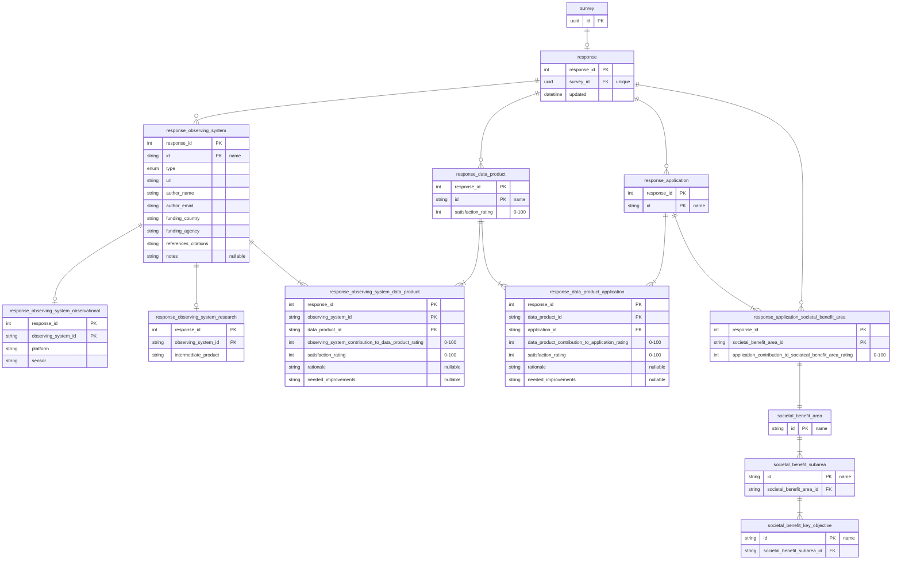

```mermaid
erDiagram

%% Dynamic operational data:
survey {
    uuid id PK
}

response {
    int response_id PK
    uuid survey_id FK "unique"
    datetime updated
}

response_observing_system {
    int response_id PK
    string id PK "name"

    enum type
    string url
    string author_name
    string author_email
    string funding_country
    string funding_agency
    string references_citations
    string notes "nullable"
}

%% This name is confusing, but "observational" _is_ a type of observing system
response_observing_system_observational {
    int response_id PK
    string observing_system_id PK

    string platform
    string sensor
}

response_observing_system_research {
    int response_id PK
    string observing_system_id PK


    string intermediate_product
}

response_observing_system_data_product {
    int response_id PK
    string observing_system_id PK
    string data_product_id PK

    int observing_system_contribution_to_data_product_rating "0-100"
    int satisfaction_rating "0-100"
    string rationale "nullable"
    string needed_improvements "nullable"
}

response_data_product {
    int response_id PK
    string id PK "name"

    int satisfaction_rating "0-100"
}

response_data_product_application {
    int response_id PK
    string data_product_id PK
    string application_id PK

    int data_product_contribution_to_application_rating "0-100"
    int satisfaction_rating "0-100"
    string rationale "nullable"
    string needed_improvements "nullable"
}

response_application {
    int response_id PK
    string id PK "name"
}

response_application_societal_benefit_area {
    int response_id PK
    string societal_benefit_area_id PK

    int application_contribution_to_sociateal_benefit_area_rating "0-100"
}


%% Static reference data:
societal_benefit_area {
    string id PK "name"
}
societal_benefit_subarea {
    string id PK "name"
    string societal_benefit_area_id FK
}
societal_benefit_key_objective {
    string id PK "name"
    string societal_benefit_subarea_id FK
}


%% Relationships
survey ||--o| response: ""

response ||--o{ response_observing_system: ""
response ||--o{ response_data_product: ""
response ||--o{ response_application: ""
response ||--o{ response_application_societal_benefit_area: ""

response_observing_system ||--o| response_observing_system_observational: ""
response_observing_system ||--o| response_observing_system_research: ""

societal_benefit_area ||--|{ societal_benefit_subarea: ""
societal_benefit_subarea ||--|{ societal_benefit_key_objective: ""

response_application_societal_benefit_area ||--|| societal_benefit_area: ""

%% Associative relationships (i.e. relationships with data)
response_observing_system ||--|{ response_observing_system_data_product: ""
response_data_product ||--|{ response_observing_system_data_product: ""

response_data_product ||--|{ response_data_product_application: ""
response_application ||--|{ response_data_product_application: ""

response_application ||--|{ response_application_societal_benefit_area: ""
```
