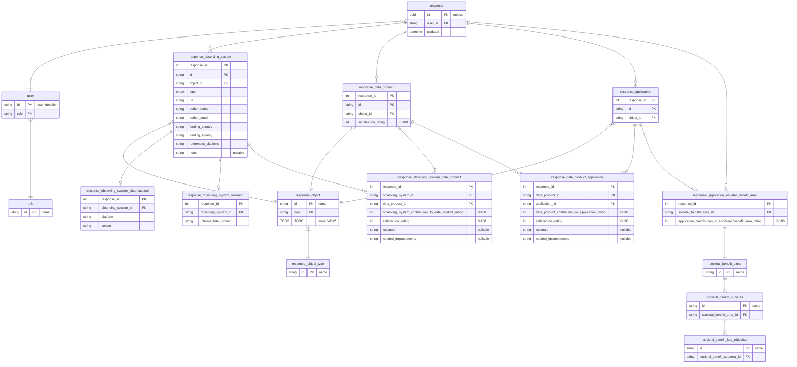

[View in Mermaid Live Editor](https://mermaid.ink/img/pako:eNrNWEtv4zYQ_isEgQVawDH8iJ2sL0WBYC-LYovungoBAi2NYrYSqZJUumrs_94hJTmiHraS9NAcHIgz83HeM9IzjWQMdEdBPXD2qFgWiEB8-EAeSsEyHhGZg2KGS8FSEjPDdoEoNCjyHAiCf9ooLh4Jj8mvn0lAHYnHIAxPOKiAelxKpkA-ffbOpIpQOKCiSFO2T6EjsucSlcoPpXfKkoSn3KmFoj9ZmZPVW4HOpdAQyv0fEJkRJdGw7jWmzF80-_bl4Uv1E9BMKiBoShrr_jUNflEgtEOvQeEv8gRKW_XsmXcVfEePmtB6KkSZjjtYnqc8cpbVRjRMFRtTipXEsEfdgY0UMANxuC_PkBguMDyDhtY5LfK4OnU2ec5D3Z4QNNSlNpA1ZnJhyJmpbW7LvX5sBwwAUWTO3R5noVLfDYU5SBW6SA2cQ8a4L5AUIrYaR7IQRpWDNPYIIvJJChJQeAo6jLhxbtceg5AGdCc9T3WJfDtwTayKBP9HUiSFRpEZ2RcGJSov1qUTUBJyHRJWZZpMyNnJpHLyBf-HHtTEaPRAahaPKU-ZSaTKvEMNQkvVr6gOHlKAqejwbn38JBIGVAYxFjeEuZJxEZmrqti-1DC_U50WSxvV957F7gFgAqAcxt6WrpGeUqFtoQgZ0MXNcrFomo_F0UjRCYuc2DBbk6t1AsB4txQAMfYAnuG9T5BhGx7M3bNf3uC461U-2bZxXcJWG5yo11C0RvpqL5aebDeObcn_aRgHvOVHa9iDny7FcfSGUMuIg2FpuAcBCcdg4XiZGKVB2X5A2td142EhsDl0MUbSi6GnS439efIqUEmMDugYdKR4brVxVzQXhN2lwINDet8ZXT_Vcxgny1c7iqKX6dRsXp39JnTD5LJlCHoxYK8Q08V-guSUaNcJ1qP_CWVtGn-Cd9xTa9q6yq2eV00-B-A3SKtl4MBzXW-8p-PNzfHoltgdilmR1ip4ko5qORtql9aJ3gDIEa-Qz2R00vWQuwLtTnaVuVVlr-EdbgB9a_p7ZOPBYT-MyzlljmTigvQf4DW7zYBR3si8bNBIh74mNFawVuvj82iyNwCjZTsm7xXdZd3DC5odyfS8cC9nw35wPe1F6Ny_a-52fblK_VlXA8E2DNWuWvIDn8O8c_Y3NwfXTH-8lh_HC2V4scz8DHkT1FSwsZWpp1I7_V4LMhHmDQ3CxRSbTG-ENqxe8McZ6Yxm-NLAeEx31PX4gJoD2K5uGWJIWJEa1-KRFV8h5ddSRHSXsFTDjFbvwfXXj_NpzsTvUuKzUUX1SHfP9Dvd3Wy2q_n69n613W4XS3zYzGhJd9vlfLFd3y9Xq83mfvNxfbc5zeg_DmE136zvtve3d7e3q-UaKbczim84Rqpfqm8v7hPM6V_eI1tF)
